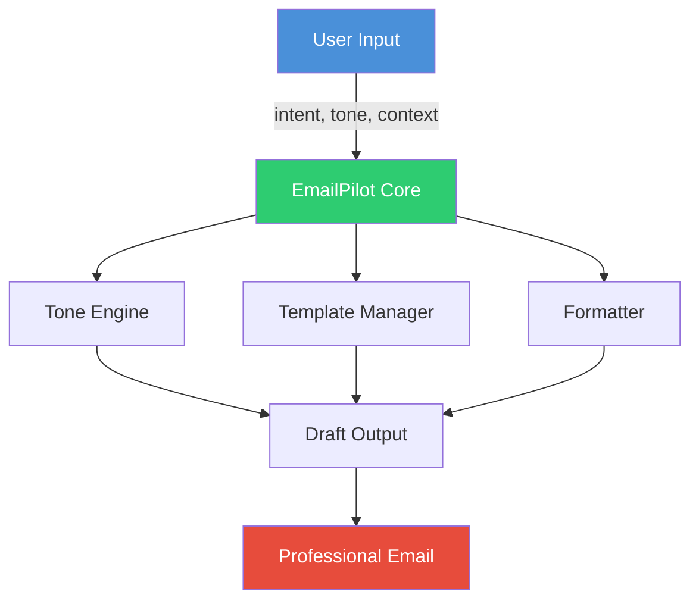

# EmailPilot

[](https://github.com/officethree/EmailPilot/actions/workflows/ci.yml)
[](https://www.python.org/downloads/)
[](LICENSE)
[](https://github.com/psf/black)

**Email drafting assistant** — a Python library that generates professional email drafts from brief instructions, with tone adjustment, template management, and formatting.

---

## Architecture



## Quickstart

### Installation

```bash
pip install emailpilot
```

Or install from source:

```bash
git clone https://github.com/officethree/EmailPilot.git
cd EmailPilot
pip install -e ".[dev]"
```

### Usage

```python
from emailpilot import EmailPilot

pilot = EmailPilot()

# Draft an email from a brief instruction
email = pilot.draft(
    intent="follow up on last week's meeting about the Q3 budget",
    tone="formal",
    context={"recipient": "Sarah", "sender": "James"}
)
print(email)

# Use a built-in template
email = pilot.use_template("meeting-request", {
    "recipient_name": "Dr. Chen",
    "sender_name": "James",
    "meeting_topic": "Product roadmap review",
    "proposed_time": "Thursday at 2 PM",
    "meeting_location": "Conference Room B",
})
print(email)

# Suggest a subject line
subject = pilot.suggest_subject("Following up on our budget discussion from last week.")
print(subject)

# Check the tone of existing text
tone_result = pilot.check_tone("We need this done ASAP, no excuses.")
print(tone_result)

# Add your own custom template
pilot.add_template("invoice-reminder", """
Dear {recipient_name},

This is a friendly reminder that invoice #{invoice_number} for {amount} is due on {due_date}.

Please let us know if you have any questions.

Best regards,
{sender_name}
""")
```

### Available Tones

| Tone       | Description                          |
|------------|--------------------------------------|
| `formal`   | Professional, business-appropriate   |
| `casual`   | Relaxed but still professional       |
| `friendly` | Warm, personable, approachable       |
| `urgent`   | Direct, action-oriented, time-sensitive |

### Built-in Templates

- `follow-up` — Follow up after a meeting or conversation
- `introduction` — Introduce yourself or someone else
- `thank-you` — Express gratitude
- `meeting-request` — Request a meeting
- `apology` — Apologize for an issue
- `status-update` — Provide a project status update

## Development

```bash
make install      # Install with dev dependencies
make test         # Run tests
make lint         # Run linter
make format       # Format code
make check        # Run all checks
```

## Inspired by

AI productivity and email assistant trends.

---

<p align="center">
Built by <strong>Officethree Technologies</strong> | Made with love and AI
</p>
